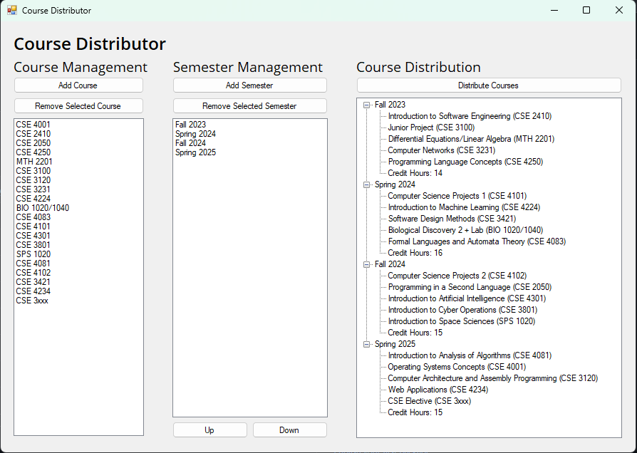
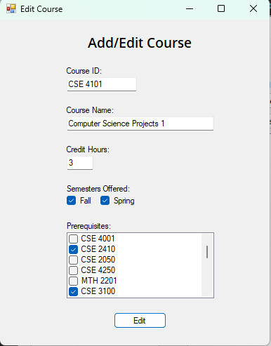
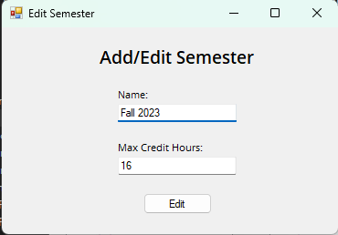

# CourseDistributor
## Background
As a student at a small, private university with exactly 52 transfer credits, deciding my schedule can be... complicated. I have a target semester for when I want to graduate, and unfortunately, coming up with a course plan that can get me there is no small feat. Once one factors in prerequisites, chains of courses, and courses only being offered in fall or spring, straying from the catalog is dangerous business. Recently, I've had to redo my course plan a couple of times, and I found myself thinking 'there has to be a better way'.

So, I decided to make one. My normal approach to this problem would be to grab a cup of coffee, boot up my IDE, and start making a Java console app. However, recently I've been trying to make projects with a wider span of langauges and frameworks (particularly <a href="https://github.com/LumaDevelopment/Velox">Android</a> and Python), so I decided to make this in ~~the language most commonly compared to Java~~ a language I've never used before, C#

## Functionality
- Add/edit/remove courses
- Add/edit/remove/reorder semesters
- Automatically distribute courses across semesters based on:
	- The amount of courses dependent on other courses
	- The fall/spring/both availability of courses
	- The number of prerequisites a course has
	- etc.

## Restrictions
CourseDistributor works by putting as many courses as it can into the first semester, then as many courses as it can into the second semester, so on and so forth until all courses are scheduled or there are no more available course placements. Due to the way courses are sorted, most of the time this results in CourseDistributor making good course lists that place all courses, even with complex prerequisite webs. However, because the scheduling is not particularly adaptive, this means that sometimes CourseDistributor will tell you that it can't place all the courses provided, even when it's technically possible.

**TODO:** New placement algorithm:

1. Use a topological sort to place courses based on prerequisites
2. Do round robin placement of courses in semesters (most credit hours first)
3. Use average number of credit hours per course, knowledge of courses with less credit hours, or some other metric to squeeze in irregular courses into semesters for maximum placement.
4. If above three steps don't work, possibly swap to some sort of more expensive permutation-based algorithm after executing step 1.

## Gallery

